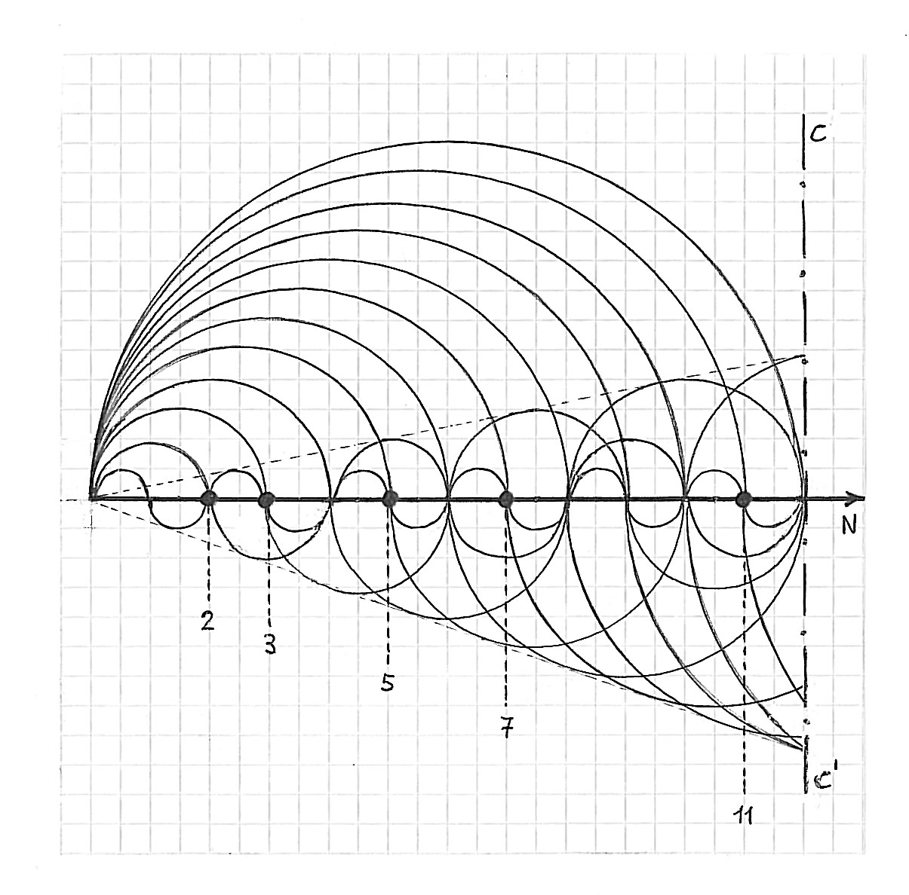

Prime Sieves and Python Data Structures
========================================

One of those recurring problems requires efficiently calculating and testing for prime numbers.
The first algorithm that comes to mind is `The Sieve of Eratosthenes`.

The Sieve, is one of many prime sieves, and is a simple yet time efficient algorithm for finding all the primes below a certain limit.

The Algorithm
=============

1.  Make a table one entry for every number between $$2 \leq{n} \leq{limit}$$
2.  Starting at 2, cross out all multiples of 2, not counting 2 itself.
3.  Move up to the next number that hasn’t been crossed out
4.  Repeat Step 2-3 up till $$\sqrt{n}$$

Big O Decomposition
-------------------
The `Sieve of Eratosthenes` algorithm is a time efficient algorithm.

### Time Complexity

$$\mathcal{O}(n\log{}\log{n})$$

A tradeoff for time however is being made for space.
Unfortunately, this algorithm requires allocating on the order of `n` values.
Since it requires a table of every number to the last integer in memory, the space complexity of sieves generally grows in the order
$$\mathcal{O}(n)$$

Visualization
-------------

Visually we can depict each loop removing values from the list of real numbers until all that is left are the primes.

In order to deal with memory issues there are sieve algorithms called `segmented sieves` which map and distribute the problem into smaller sizes and are computed in parallel.

Implementation
==============

@[Python Sieve]({"stubs": ["sieve.py"], "command": "python3 sieve.py"})
